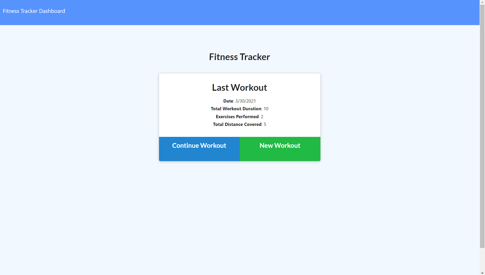
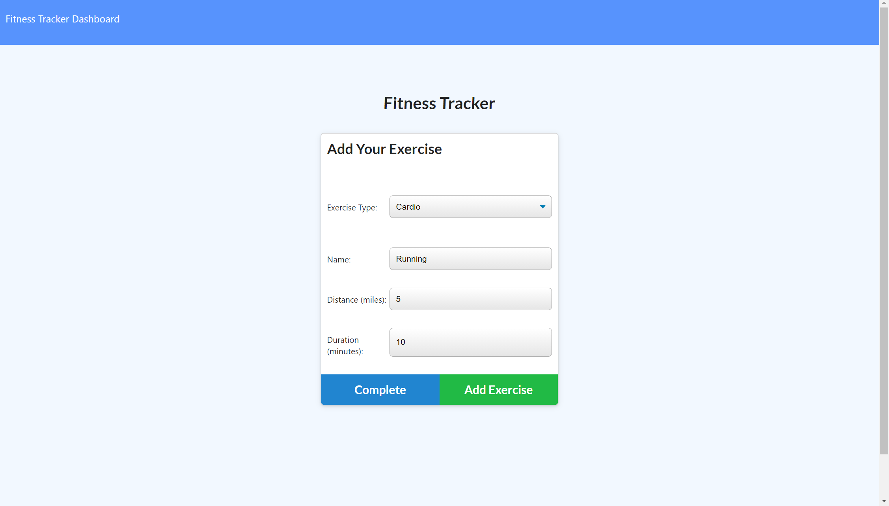
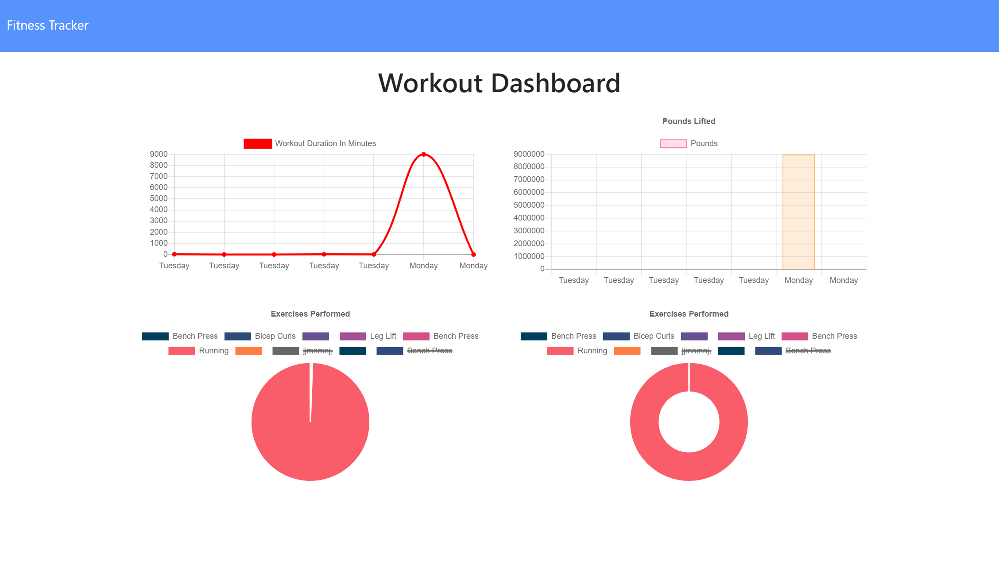

# workoutTracker

## Description

This application uses MongoDB to store the data entered by the user. Express, mongoose, and morgan are also dependencies of this app. Heroku is used for deployment.

## Installation 
If installing locally, navigate to WorkoutTracker directory and run "npm i" to install dependencies. 

The deployed application can be found here: 
https://aqueous-tor-34611.herokuapp.com/?id=60626bfdaddd920015c13eb9

## Screenshots
Homepage:

Adding workout:

Dashboard

## Questions
* [GitHub Profile](http://github.com/Osteophagy)